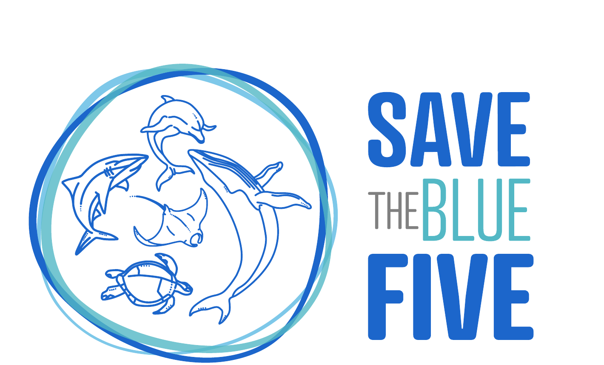

## {background-image="../../shared/assets/images/whale-shark-wide.jpg" background-size="cover" background-position="center" .title-photo}

<h1>Marine Megafauna and Climate Change Modeling Workshop</h1>

Save the Blue Five | Santa Cruz, Galápagos | June 8-12, 2026

Climate projections, biological data readiness, and first-generation species distribution models

<strong>Isaac Brito-Morales, PhD</strong> 
June 2026

---














